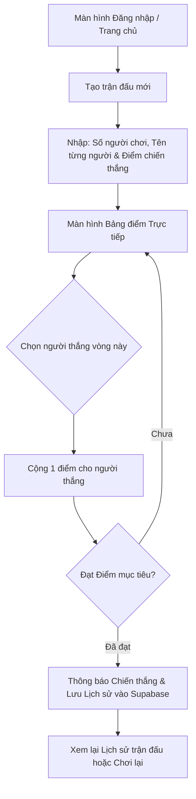

# 🎯 ScoreMaster — Web Ứng Dụng Tính Điểm Đa Nền Tảng (Mobile & Desktop)

Ứng dụng web tính điểm gọn nhẹ, trực quan, hỗ trợ thiết bị di động và máy tính, phục vụ các trò chơi gia đình, board game, thể thao mini hoặc trò chơi nhóm.

---

## 🌟 1. Giới thiệu tổng quan

**ScoreMaster** là giải pháp ghi chép điểm số tức thì với cơ chế tính điểm rõ ràng:

- **Thắng:** `+1` điểm.
- **Thua:** `+0` điểm (giữ nguyên).
- **Điều kiện thắng:** Tùy chỉnh số điểm trúng đích (Target Score) để tự động phân định người chiến thắng chung cuộc.
- **Linh hoạt người chơi:** Tự do tùy chỉnh số lượng và tên từng người chơi.
- **Lưu trữ & Lịch sử:** Đăng nhập tài khoản để đồng bộ dữ liệu và xem lại toàn bộ lịch sử các ván đấu qua đám mây.

---

## 🚀 2. Tính năng chính (Key Features)

### 👥 Thiết lập trận đấu (Match Setup)

- **Số lượng người chơi:** Tùy chọn số lượng linh hoạt (2, 3, 4 hoặc nhiều hơn).
- **Tên người chơi:** Cho phép đặt tên riêng hoặc dùng tên mặc định (Player 1, Player 2,...).
- **Điểm mục tiêu (Target Score):** Thiết lập mốc điểm cần đạt để kết thúc trận đấu (ví dụ: 3, 5, 10, 21 điểm).

### ⚡ Bộ đếm điểm thông minh (Live Scoreboard)

- **Thao tác 1 chạm:** Giao diện tối ưu nút bấm lớn trên điện thoại và click mượt mà trên desktop.
- **Cơ chế điểm:**
  - Nhấn chọn người thắng vòng này ➔ Cộng ngay **1 điểm**.
  - Người thua ➔ Không cộng điểm (`+0`).
  - Hỗ trợ hoàn tác (Undo) nếu nhập nhầm điểm.
- **Thông báo chiến thắng:** Khi có người chơi đạt điểm mục tiêu, hệ thống hiển thị màn hình chúc mừng (Victory Modal kèm hiệu ứng pháo hoa Confetti) và khóa bảng điểm để lưu kết quả.

### 🔐 Tài khoản & Đồng bộ đám mây (Auth & Cloud Sync)

- **Đăng nhập/Đăng ký:** Hỗ trợ đăng nhập nhanh qua Email/Mật khẩu hoặc Google OAuth.
- **Lịch sử ván đấu (Match History):**
  - Tự động ghi nhận ngày giờ, danh sách người chơi, diễn biến từng hiệp và người thắng cuộc.
  - Bộ lọc xem lại lịch sử theo ngày hoặc tìm kiếm theo tên người chơi.

### 🎨 Thiết kế Giao diện (UI/UX)

- **Phong cách:** Hiện đại, tối giản (Minimalist), sạch sẽ (Clean UI).
- **Chủ đề sáng (Light Mode):** Tông nền trắng/kem dịu mắt, các khối thẻ phân cách rõ ràng, màu sắc điểm nhấn tinh tế (Pastel / Slate Blue / Emerald).
- **Responsive hoàn hảo:**
  - **Mobile:** Nút bấm to, thao tác dễ dàng bằng một tay, không cần zoom hay cuộn trang phức tạp.
  - **Desktop:** Bảng điều khiển rộng rãi, trực quan, hỗ trợ phím tắt số nhanh.

---

## 🛠️ 3. Công nghệ sử dụng (Tech Stack)

| Thành phần              | Công nghệ                              | Mô tả                                                                         |
| :------------------------ | :--------------------------------------- | :------------------------------------------------------------------------------ |
| **Front-end**       | **Next.js 14+ (App Router)**       | Framework React hỗ trợ SSR/SSG tối ưu SEO, hiệu năng mượt mà           |
| **Styling**         | **Tailwind CSS + Shadcn UI**       | Tạo giao diện sáng màu, hiện đại, chuẩn Responsive cho mobile & desktop |
| **Back-end & Auth** | **Supabase Auth**                  | Xác thực người dùng bảo mật, dễ tích hợp                              |
| **Database**        | **Supabase (PostgreSQL)**          | Cơ sở dữ liệu quan hệ mạnh mẽ, hỗ trợ Realtime đồng bộ tức thì    |
| **Icons & Effects** | **Lucide React + Canvas Confetti** | Bộ icon nhẹ nhàng và hiệu ứng ăn mừng chiến thắng                     |

---

## 🗄️ 4. Thiết kế Cơ sở Dữ liệu (Database Schema)

Dự án sử dụng cơ sở dữ liệu PostgreSQL trên Supabase với các bảng chính:

```sql
-- 1. Bảng hồ sơ người dùng (liên kết với auth.users của Supabase)
create table profiles (
  id uuid references auth.users on delete cascade primary key,
  email text,
  full_name text,
  created_at timestamp with time zone default timezone('utc'::text, now()) not null
);

-- 2. Bảng trận đấu (Matches)
create table matches (
  id uuid default gen_random_uuid() primary key,
  user_id uuid references profiles(id) on delete cascade not null,
  title text default 'Trận đấu mới',
  target_score int not null default 5,
  status text check (status in ('in_progress', 'completed')) default 'in_progress',
  winner_name text,
  created_at timestamp with time zone default timezone('utc'::text, now()) not null,
  ended_at timestamp with time zone
);

-- 3. Bảng người chơi tham gia trận đấu (Match Players)
create table match_players (
  id uuid default gen_random_uuid() primary key,
  match_id uuid references matches(id) on delete cascade not null,
  player_name text not null,
  current_score int default 0,
  player_order int not null
);

-- 4. Bảng chi tiết từng hiệp đấu (Match Rounds / Logs)
create table match_rounds (
  id uuid default gen_random_uuid() primary key,
  match_id uuid references matches(id) on delete cascade not null,
  round_number int not null,
  winner_player_id uuid references match_players(id) on delete set null,
  created_at timestamp with time zone default timezone('utc'::text, now()) not null
);
```

---

## 📱 5. Luồng trải nghiệm người dùng (User Flow)



---

## 💻 6. Hướng dẫn cài đặt & Khởi chạy (Local Development)

### Bước 1: Clone mã nguồn

```bash
git clone https://github.com/your-username/scoremaster.git
cd scoremaster
```

### Bước 2: Cài đặt dependencies

```bash
npm install
# hoặc
pnpm install / yarn install
```

### Bước 3: Cấu hình biến môi trường

Tạo file `.env.local` ở thư mục gốc:

```env
NEXT_PUBLIC_SUPABASE_URL=https://your-project.supabase.co
NEXT_PUBLIC_SUPABASE_ANON_KEY=your-anon-key-here
```

### Bước 4: Chạy dự án ở môi trường local

```bash
npm run dev
```

Mở trình duyệt tại: `http://localhost:3000`

---

## 🔮 7. Kế hoạch phát triển tiếp theo (Roadmap)

- [ ] Hỗ trợ **PWA (Progressive Web App)** để cài đặt trực tiếp vào màn hình chính điện thoại như ứng dụng native.
- [ ] Tính năng **Realtime Multiplayer Scoreboard**: Cho phép người xem khác cùng quét mã QR để theo dõi điểm số trực tiếp từ xa.
- [ ] Thống kê biểu đồ phong độ và tỷ lệ thắng của từng người chơi theo tuần/tháng.
- [ ] Hỗ trợ âm thanh phản hồi (Sound FX) vui nhộn khi ghi điểm hoặc chiến thắng.
